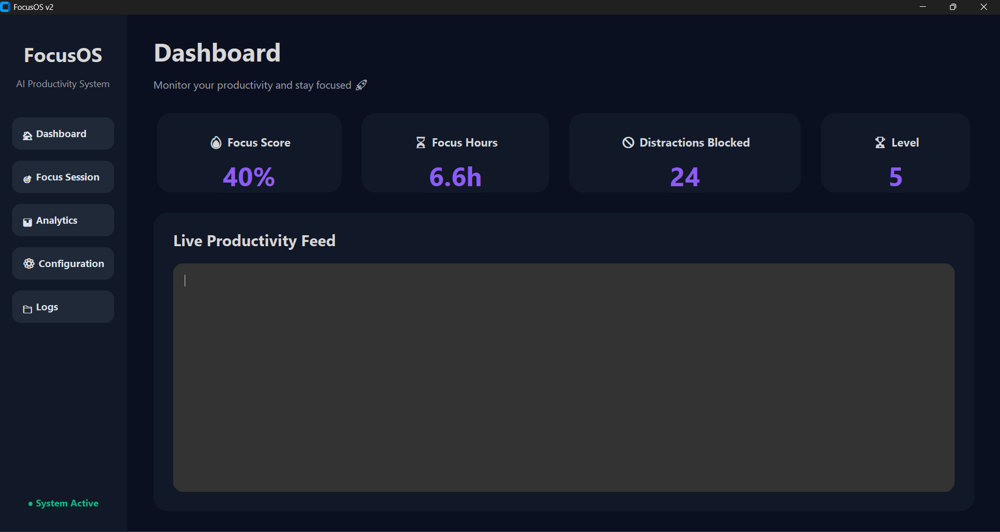
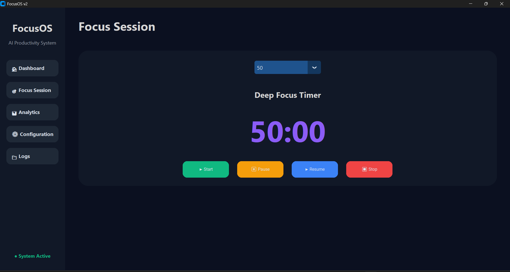
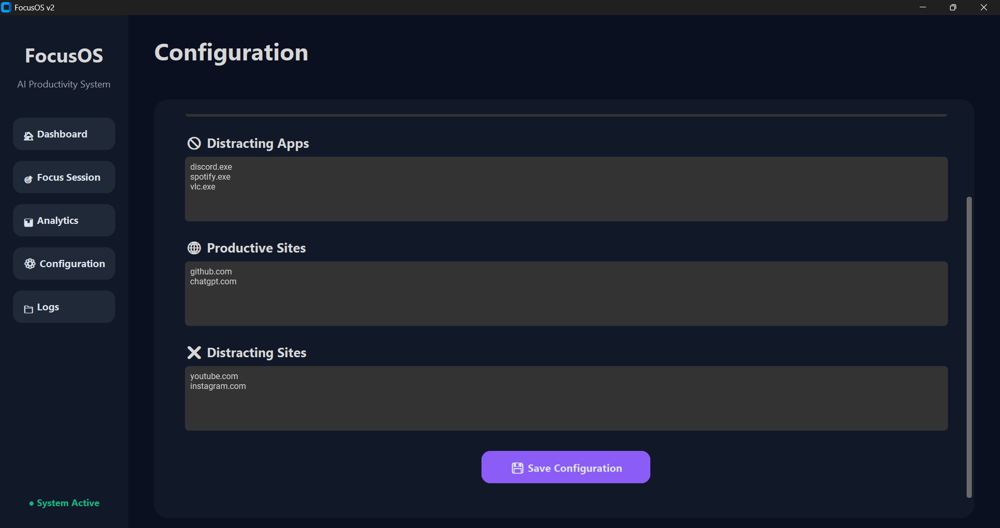
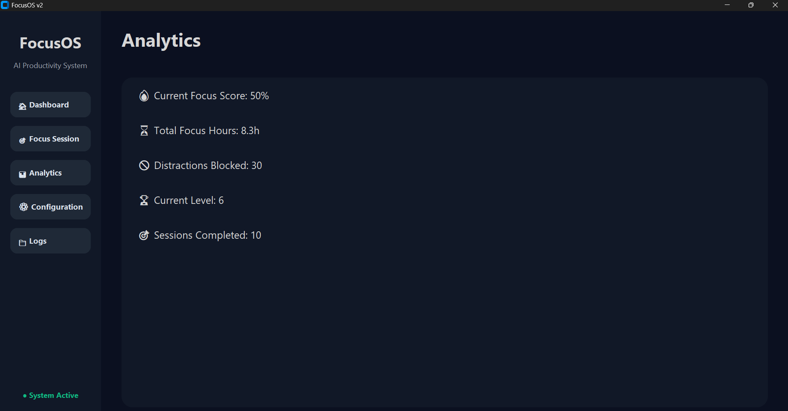

# 🚀 FocusOS

Modern productivity management desktop application with real-time distraction blocking and focus analytics.

---

## 📌 Overview

FocusOS is a modern desktop productivity system designed to help users stay focused by:

* Blocking distracting applications
* Blocking distracting websites
* Running deep-focus sessions
* Tracking productivity analytics
* Monitoring focus statistics
* Maintaining activity logs

The project combines productivity management with a clean modern UI to create a distraction-free work environment.

---

# ✨ Features

## 🎯 Focus Session System

* Deep focus timer
* Start / Pause / Resume / Stop controls
* Real-time countdown display
* Automatic session completion handling

## 🚫 App Blocking

Block distracting applications such as:

* Discord
* Spotify
* VLC
* Other custom applications

## 🌐 Website Blocking

Block distracting websites during focus sessions:

* YouTube
* Instagram
* Social media sites
* Custom websites

## 📊 Productivity Dashboard

Track:

* Focus score
* Focus hours
* Distractions blocked
* Productivity level

## 📁 Activity Logs

Live productivity feed displaying:

* Session start events
* Session completion events
* Blocking activity
* Monitoring status

## ⚙ Configuration System

Customizable:

* Productive apps
* Distracting apps
* Productive websites
* Distracting websites

Configurations are saved permanently using JSON.

---

# 🖥 UI Preview

## Dashboard



## Focus Session



## Configuration



## Analytics



---

# 🛠 Tech Stack

* Python 3.13
* CustomTkinter
* JSON
* PowerShell
* Git & GitHub

---

# 📂 Project Structure

```bash
FocusOS/
│
├── core/
│   ├── config_manager.py
│   ├── focus_engine.py
│   ├── logger.py
│   ├── process_manager.py
│   ├── stats_manager.py
│   └── website_blocker.py
│
├── data/
│   ├── config.json
│   └── user_stats.json
│
├── main.py
├── README.md
└── .gitignore
```

---

# ⚡ Installation

## 1️⃣ Clone Repository

```bash
git clone https://github.com/Lithiya182/FocusOS.git
cd FocusOS
```

## 2️⃣ Install Dependencies

```bash
pip install -r requirements.txt
```

## 3️⃣ Run Application

```bash
python main.py
```

---

# 🔮 Future Improvements

* Real-time productivity detection
* AI-based activity classification
* Smart productivity scoring
* Chrome tab monitoring
* Productivity streak system
* Advanced analytics graphs
* Theme customization
* Cross-platform support

---

# 🎓 Project Purpose

This project was developed as a productivity-focused desktop application to explore:

* Python desktop development
* Productivity systems
* Focus management
* Process monitoring
* Configuration persistence


